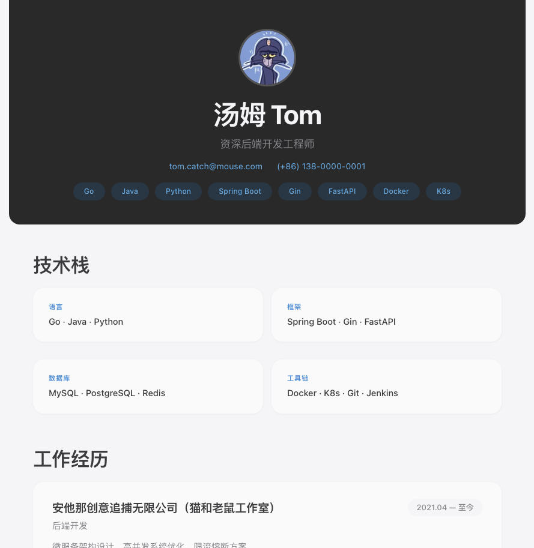
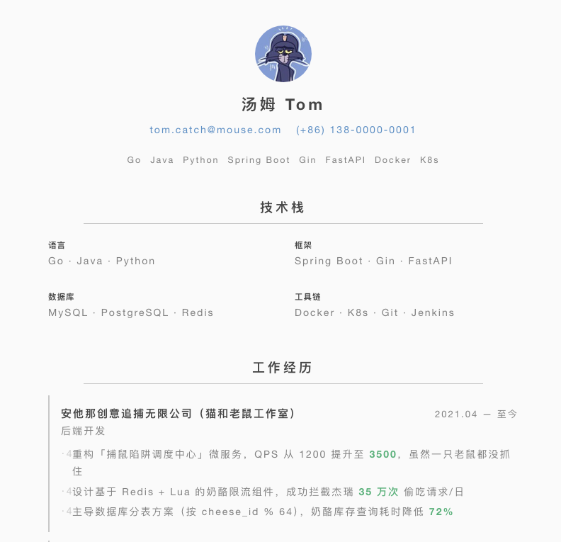
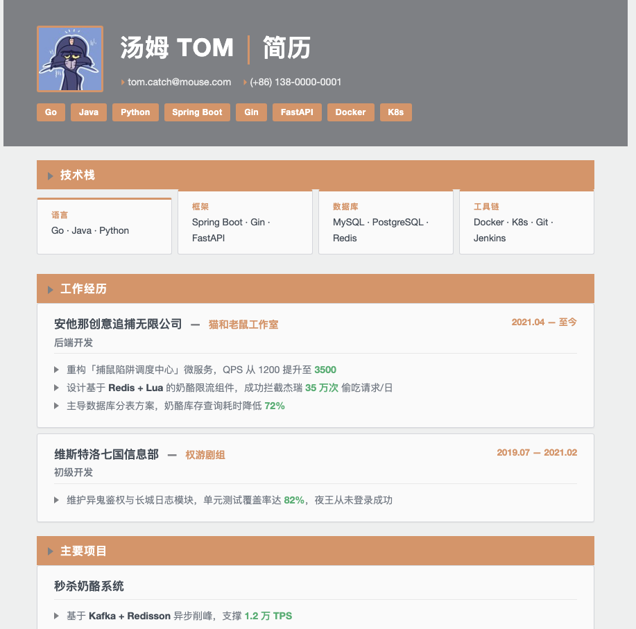
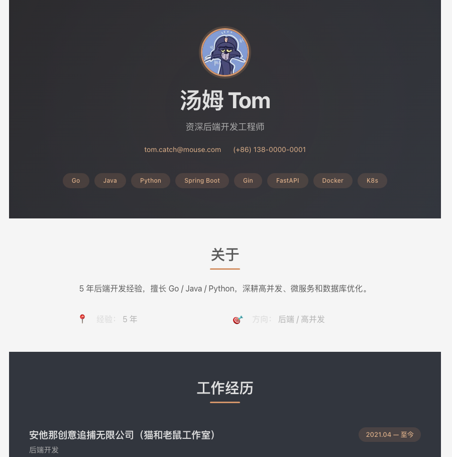

# Resume Builder

[中文版](README.md)

Got a pile of weekly reports, emails, class notes, old resumes, and photos lying around?

Install this skill, dump your materials into the chat, and let the agent handle the rest. For students, class notes, lab reports, and project docs can be turned into skills and project experience automatically.

---

### Preview

<table>
<tr>
<td align="center">
  <br><br><b>Apple</b> — Dark hero header, large typography, card grid, blue links
</td>
<td align="center">
  <br><br><b>Minimal</b> — Centered layout, bottom dividers, left-border accents
</td>
</tr>
<tr>
<td align="center">
  <br><br><b>Corporate</b> — Orange accent, colored section bars, arrow bullets
</td>
<td align="center">
  <br><br><b>Pulse</b> — Dark/light alternating sections, skill bars, animated glow
</td>
</tr>
</table>

---

### Install

Pick your tool:

**🚀 Hermes:**
```bash
git clone https://github.com/HeisenbergUwU/resume-builder-skill.git ~/.hermes/skills/resume-builder
```

**🦞 OpenClaw:**
```bash
git clone https://github.com/HeisenbergUwU/resume-builder-skill.git ~/.openclaw/skills/resume-builder
```

**💻 Cursor / Claude Code / Generic:**
```bash
git clone https://github.com/HeisenbergUwU/resume-builder-skill.git skills/resume-builder
```

---

### How to Use

Just start chatting:

> Turn these weekly reports and emails into a resume
>
> Extract skills and build a student resume from my class notes and lab reports

Once it's generated, you can iterate:

> Switch to corporate style, make it more professional
>
> Make the colors more vibrant
>
> Translate to Chinese
>
> Export as PDF

That's it.

---

### What It Does

| Feature | Description |
|---------|-------------|
| Multi-source | .eml / .msg / .html / .txt / .md / .jpg / .png — all supported |
| Student-friendly | Class notes, lab reports, and project docs auto-extracted into skills and experience |
| Career Guides | Computer Science · Human Resources · Marketing |
| Style Themes | apple · minimal · corporate · pulse |
| Avatar | Auto-discover, center-crop, Base64 embed |
| Multi-format | HTML + Markdown + PDF |

---

### Custom Styles

Four built-in themes not enough? Drop your own under `assets/styles/` and PR it back.
