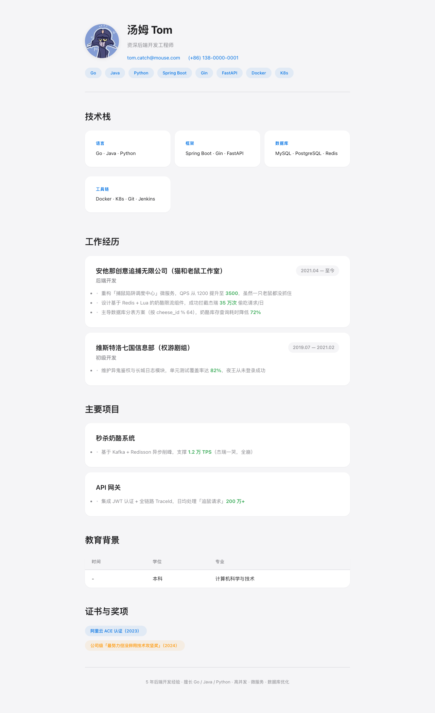

# Resume Builder

[English](README-en.md)

**从资料包（邮件周报、旧简历、照片等）生成精美的简历，支持 HTML、Markdown 和 PDF 输出。**

HTML 版本内联 CSS + Base64 头像，无外部依赖，浏览器直接打开，可邮件发送，可打印。

---

### 效果预览

<p align="center">
  <br>
  <sub>Apple 风格</sub>
</p>

---

### 安装

**🚀 Hermes:**
```bash
git clone https://github.com/HeisenbergUwU/resume-builder-skill.git ~/.hermes/skills/resume-builder
```

**🦞 OpenClaw:**
```bash
git clone https://github.com/HeisenbergUwU/resume-builder-skill.git ~/.openclaw/skills/resume-builder
```

**💻 Cursor / Claude Code / 通用:**
```bash
git clone https://github.com/HeisenbergUwU/resume-builder-skill.git skills/resume-builder
```

### 提示词示例

安装后，直接在对话中使用：

**从资料包生成简历：**
> 用我的资料包生成一份简历
> 这些材料帮我整理成简历，输出 HTML 和 Markdown

**技术岗：**
> 帮我把这些周报提取成简历，我投后端开发岗，用 apple 风格

**HR 岗：**
> 用这些资料帮我写一份人力资源简历，突出招聘和员工关系，用 corporate 风格

**市场运营：**
> 我从零散的邮件和文档里整理简历，目标是增长运营，minimal 风格

**多语言：**
> 把上面的简历翻译成英文版本

### 支持能力

| 能力 | 说明 |
|------|------|
| 多源提取 | .eml / .msg / .html / .txt / .md / .jpg / .png |
| 职业指南 | 计算机科学 · 人力资源 · 市场运营 |
| 样式主题 | apple · minimal · corporate |
| 头像处理 | 自动选取 + 居中裁剪 + Base64 嵌入 |
| PDF 导出 | 一键从 HTML 生成 PDF，支持多种转换方式 |
